  

 INSTITUTO TECNOLÓGICO SUPERIOR DE CHICONTEPEC

   
          INGENIERÍA EN SISTEMAS COMPUTACIONALES

MATERIA:

Tópicos Selectos de Programación Web

Alumno:
Abelardo Martinez de la cruz 
Docente:
Lic. Said Jair Guerra Escudero               

Chicontepec de Tejeda, Veracruz octubre 2024.
 

Manual de instalación y configuración de Django:

* Se crea una carpeta con el comando: (mkdir django) en el cmdr.
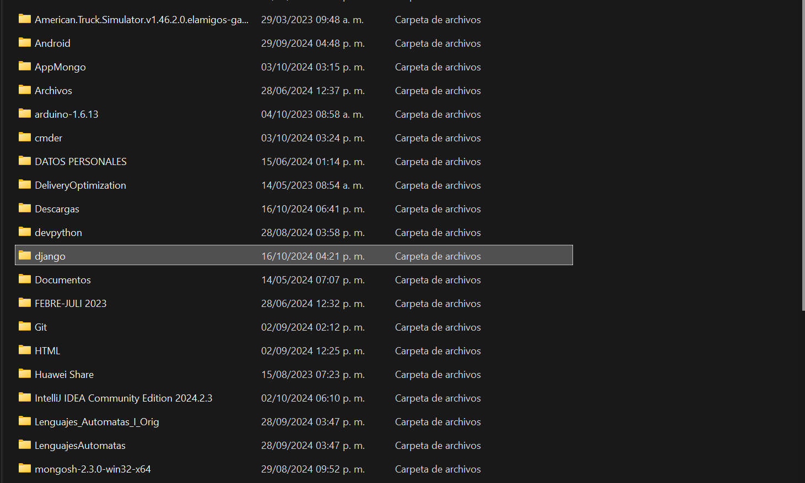
* Se copia la ruta de la carpeta
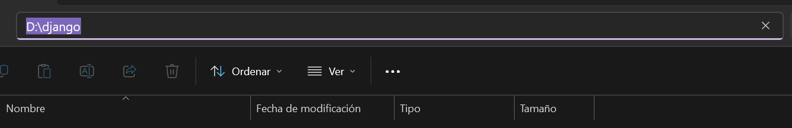 
 
* La ruta de la carpeta se pega en el cmdr se abre la carpeta y una vez dentro se comenzara a ejecutar los siguientes comandos tal cual cómo se lleva el orden:
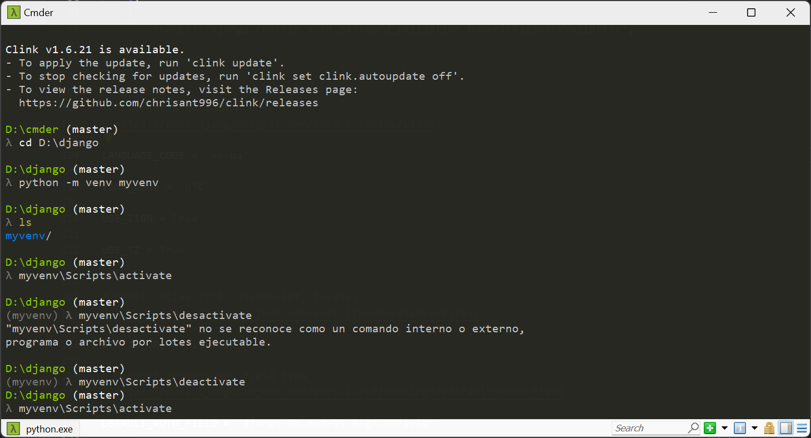 
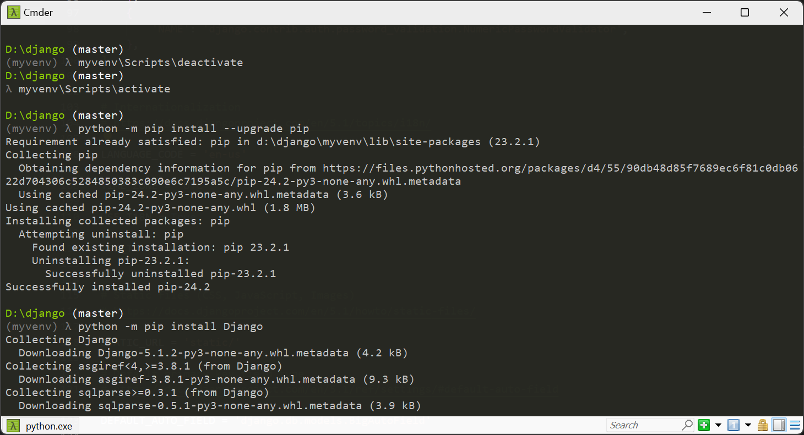 
* 1.- python -m venv myvenv ------- Hacer el virtualenv llamado myvenv.
* 2.- ls ------Ver si se creo
* 3.- myvenv\Scripts\actívate ------- Activar el entorno virtual creado llamado myvenv.
* 4.- myvenv\Scripts\desactivate ------ Para desactivar el entorno virtual.
* 5.- myvenv\Scripts\actívate 
* 6.- python -m pip install --upgrade pip ------Verificar versión de pip. 
* 7.- python -m pip install Django ------Instalación de django.
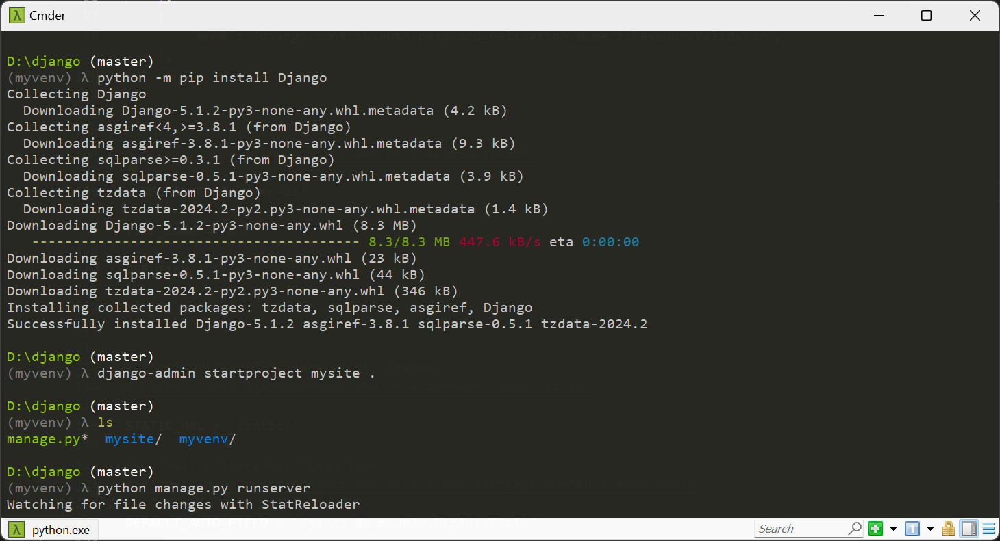 
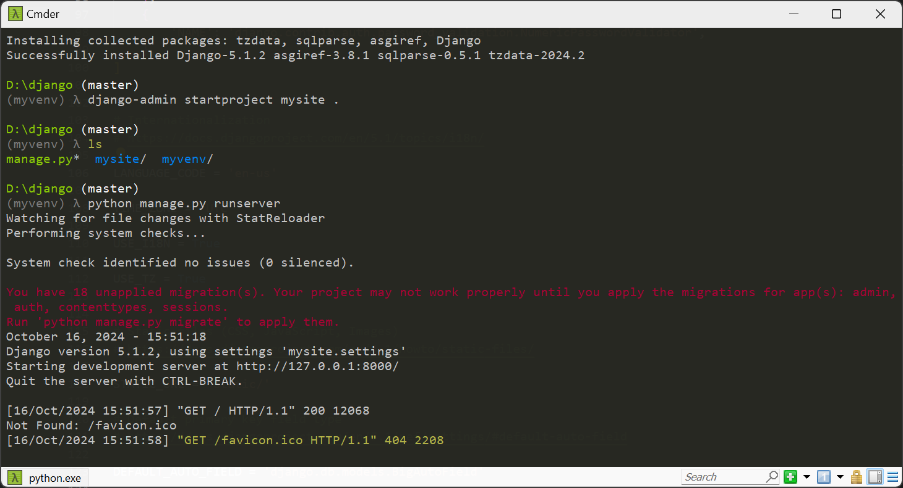 
Una vez instalado django ejecutamos los comandos que siguen:
* 8.- django-admin starproject mysite ------Crear un proyecto en django.
* 9.- ls ------Ver las carpetas.
* 10.- python manage.py runserver ------Para iniciar.
Para verificar que hicimos todos los pasos correctos daremos clic en el link siguiente, http:/127.0.0.1:8000/.
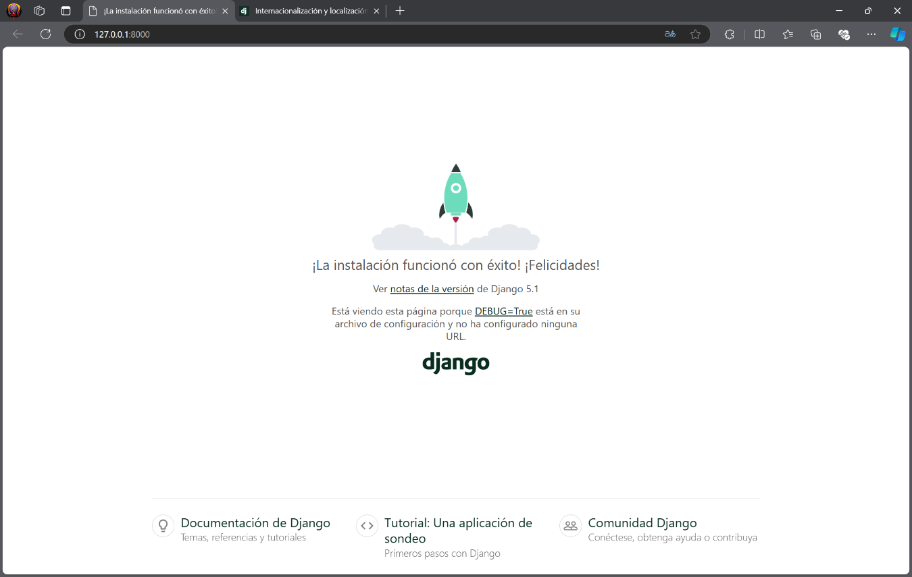 
Mostrará la siguiente ventana.
Continuando con los comandos ejecutamos los siguientes:
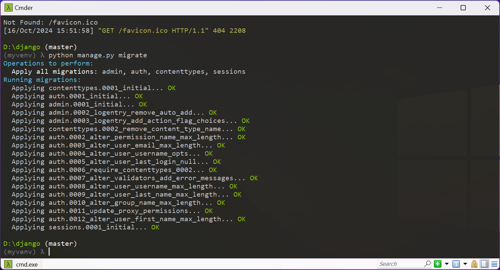 
* 11.- Python manage.py migrate 
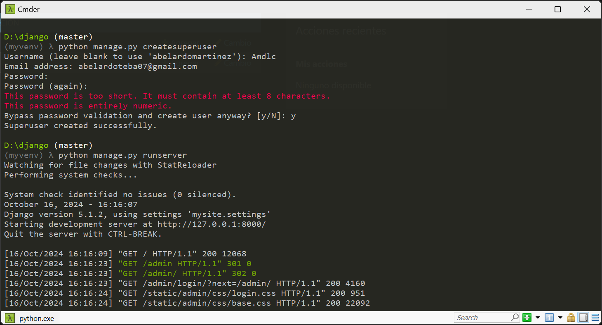  
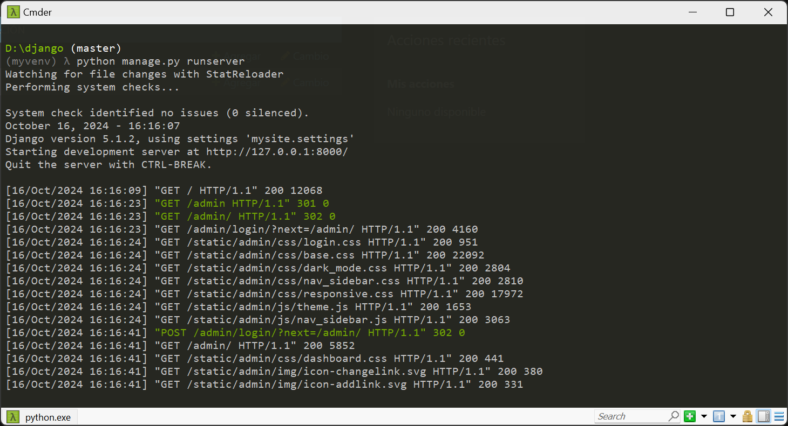 
* 12.- python manage.py createsuperuser ------Crear el usuario.
* 13..- Python manage.py runserver -----Correr el servicio.
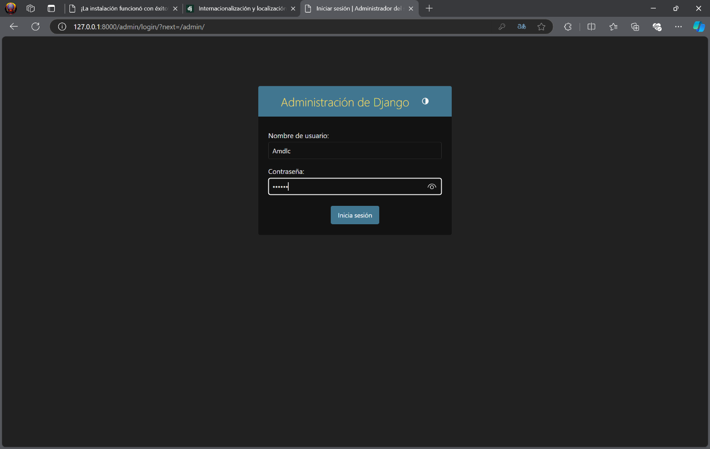 
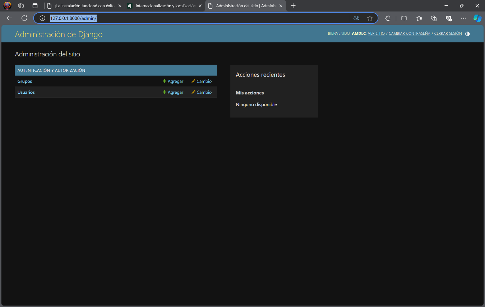 
Utilizando la misma dirección anterior ahora colocaremos lo siguente http:/127.0.0.1:8000/admin para poder ingresar al administrador de django con los datos que pusimos anteriormente.

